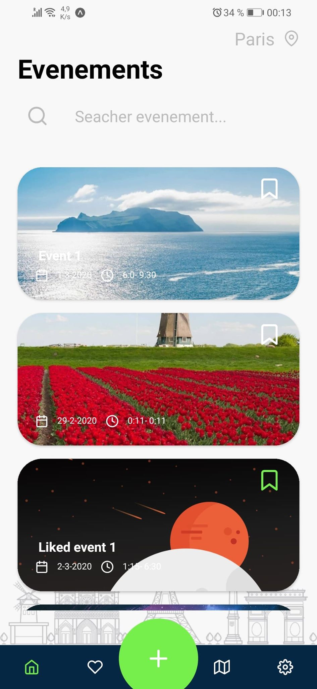

# EventFR - Askip -

this repo represent my simple implementation with React native of an event checking app in France, this project can run on both Ios and Android with almost all the code in common (power of using expo SDK).

The architecture proposed in this implementation can help new react native developers in understanding how the flow of screens and api events work, its not a perfect architecture, but a good and maintainable one.

## Folders structure

this project is devised into multiple folders to allow code decomposition and architecture maintainability in the future. Globally, we can find two main folders:

- **Assets**
- **src**

In the Assets Folder we put our images and custom styles while in the src folder, our application code.

this source folder is composed of 6 sub-folders each containing a specific code, there are represented like so :

- **API folder :** containing api requests for multiple tasks (each task in its file like event requests in the EventApi file) ==> we can say that this folder is similar to the repositoriy folder in an MVC architecture.
- **Components folder :** containing our react native components (that keeps repeating or that are not entire screens) .
- **Constants :** we put in this folder our app constants used in the project, like the axios Instance for exemple (its like the singleton pattern).
- **Navigation :** in any app, especially a react native app we need to handle Routes and navigations, this folder structure them and try to provide a simple interface to access some handlers of the root navigator.
- **screens :** this folder is self explanatory, each file represent a screen in the app that is routed with the configuration in the navigation folder above.
- **Utils :** we need sometimes to use some treatment before doing a certain task, in this folder we find the code for those custom treatment (we can compare this folder to the services folder in an MVC architecture).

## How does the app look like ?

- **Add Event Screen :** 

|         first step         |           second            |            third            |           fourth            |
| :------------------------: | :-------------------------: | :-------------------------: | :-------------------------: |
|  |  |  |  |

- **Calendar :**

  

- **Map :**

  

- **favorite Events :** 

- **Event Details :**

- **Fix Hour And Date :**

|           fix hour           |           fix date           |
| :--------------------------: | :--------------------------: |
|  |  |

- **Settings :** 

- **Home :**

## How to run

1. Prepare your environment by following the getting started [tutorial](https://docs.expo.io/).
2. clone this repo, and go to the project root directory.
3.  run yarn install.
4. run expo start.

------

For anyone interested with the project, feel free to contact me anytime in my email: 

[fa_djellal@esi.dz]()